# Rust AI Agent Architecture

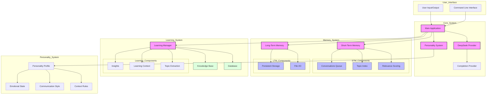

## Workflow Description

1. **User Interaction Flow**
   - User inputs text through CLI
   - Main application processes input
   - DeepSeek provider generates responses
   - Personality system shapes response style

2. **Memory Management**
   - Short-Term Memory:
     * Stores recent conversations
     * Indexes topics
     * Calculates relevance
   - Long-Term Memory:
     * Persists important information
     * Handles file I/O
     * Maintains historical data

3. **Learning Process**
   - Learning Manager coordinates:
     * Insight generation
     * Context building
     * Topic extraction
   - Integrates with:
     * Knowledge Base
     * Database
     * Memory Systems

4. **Personality System**
   - Manages:
     * Personality Profiles
     * Emotional States
     * Communication Styles
     * Context Rules
   - Influences:
     * Response Generation
     * Interaction Style
     * Language Complexity

## Key Components

### Core System
- Main Application: Central coordinator
- Personality System: Response shaping
- DeepSeek Provider: AI completion
- Completion Provider: Response generation

### Memory System
- Short-Term Memory: Recent context
- Long-Term Memory: Historical data
- Topic Indexing: Quick retrieval
- Relevance Scoring: Context importance

### Learning System
- Learning Manager: Knowledge acquisition
- Knowledge Base: Information storage
- Database: Structured data
- Insight Generation: Pattern recognition

### Personality System
- Profile Management: Character definition
- Emotional Expression: Response tone
- Communication Rules: Interaction style
- Context Adaptation: Situation handling

## Subsystem Diagrams

### 1. Memory Subsystem
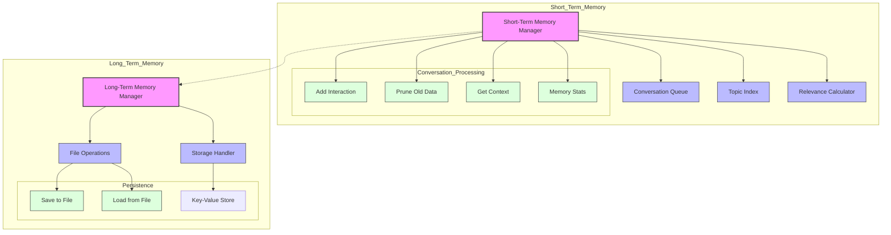

### 2. Learning Subsystem
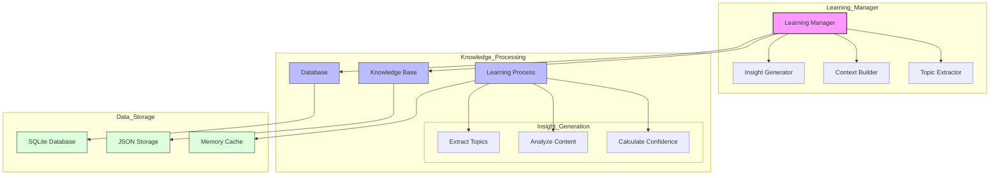

### 3. Personality Subsystem
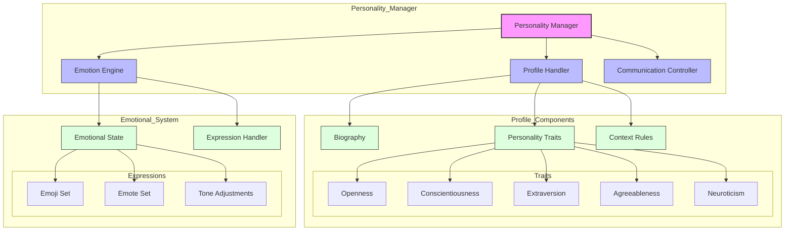

### 4. DeepSeek Integration
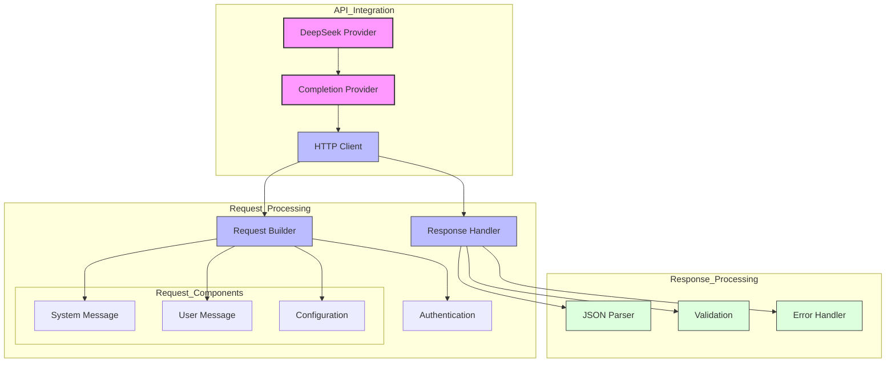

## Sequence Diagrams

### 1. User Interaction Flow
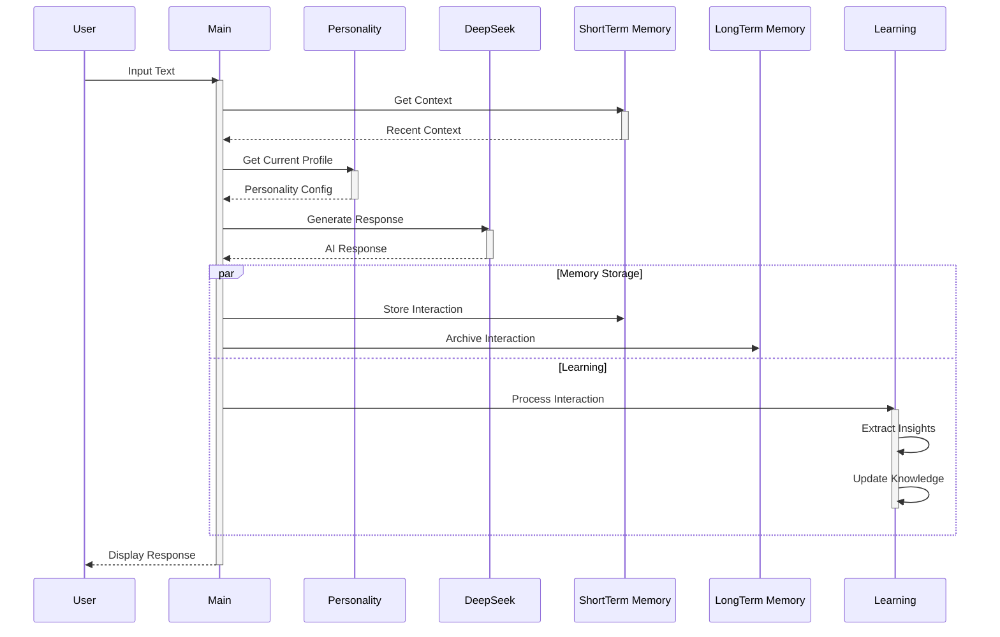

### 2. Memory Management Flow
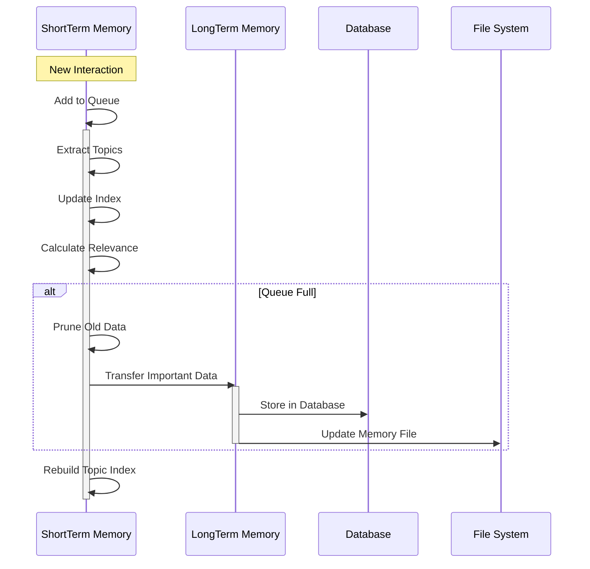

### 3. Learning Process Flow
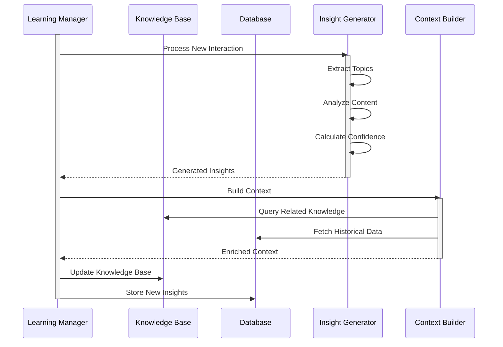

### 4. Personality Adaptation Flow
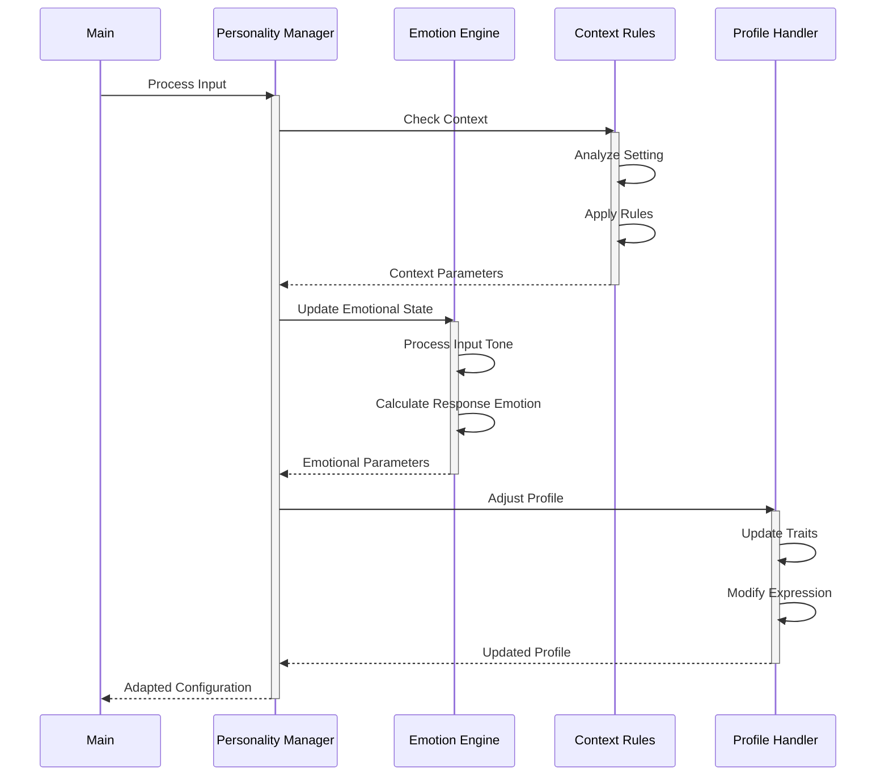

### 5. DeepSeek API Interaction Flow
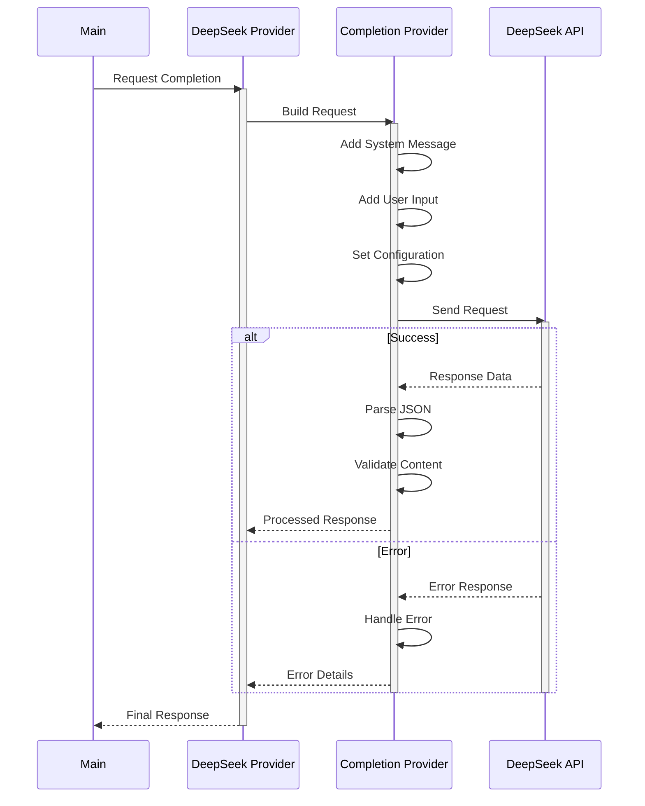

## Timing Diagrams

### 1. Request-Response Cycle Timing
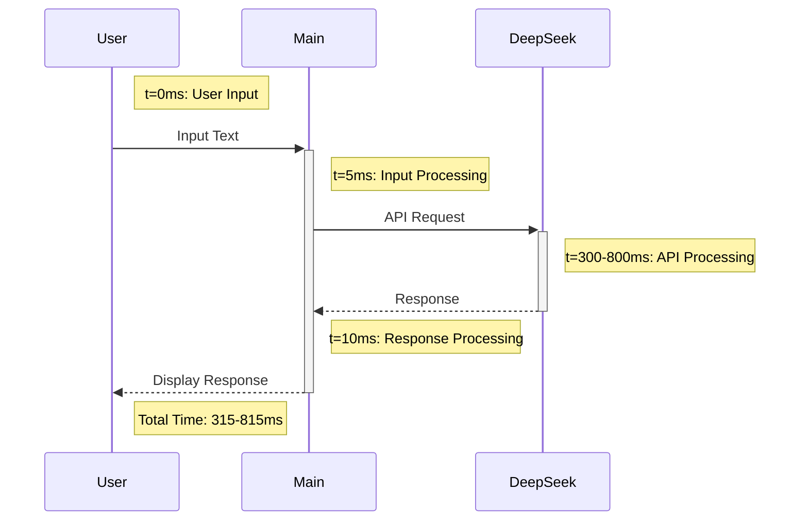

### 2. Memory Operations Timing
```mermaid
gantt
    title Memory Operations Timeline
    dateFormat  X
    axisFormat %L ms

    section Short-Term Memory
    Topic Extraction      :0, 20ms
    Relevance Calculation :20ms, 15ms
    Index Update         :35ms, 10ms
    
    section Long-Term Memory
    Data Serialization   :45ms, 25ms
    File Write          :70ms, 30ms
    
    section Database
    Connection          :0, 5ms
    Query Execution     :5ms, 15ms
    Data Storage        :20ms, 25ms
```

### 3. Parallel Processing Performance
```mermaid
gantt
    title Parallel Processing Timeline
    dateFormat  X
    axisFormat %L ms

    section Main Thread
    Input Processing    :0, 10ms
    Response Generation :10ms, 400ms
    
    section Memory Thread
    Context Retrieval   :0, 15ms
    Storage Operations  :15ms, 35ms
    
    section Learning Thread
    Topic Analysis      :0, 25ms
    Knowledge Update    :25ms, 40ms
    
    section Database Thread
    Write Operations    :15ms, 30ms
```

### 4. Component Load Distribution
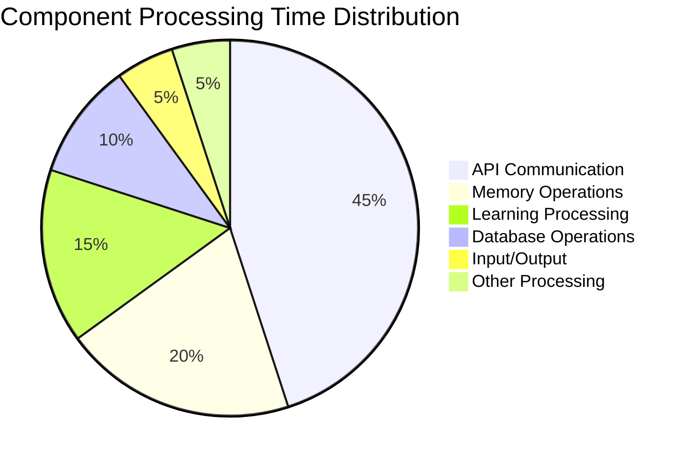

### 5. System Performance Metrics
```mermaid
xychart-beta
    title "Response Time vs Load"
    x-axis [0, 10, 20, 30, 40, 50] "Concurrent Users"
    y-axis "Response Time (ms)" 1000
    line ["200", "300", "450", "650", "800", "950"]
    title "Memory Usage vs Operations"
    x-axis [0, 100, 200, 300, 400, 500] "Operations"
    y-axis "Memory (MB)" 500
    line ["50", "100", "175", "275", "400", "450"]
```

### 6. Critical Path Analysis
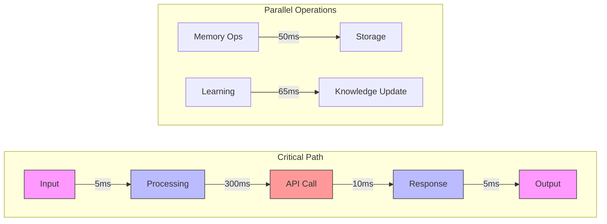

### Performance Notes:

1. **Response Time Breakdown**:
   - Input Processing: 5-10ms
   - API Communication: 300-800ms
   - Memory Operations: 45-100ms
   - Learning Processing: 65-120ms
   - Database Operations: 30-60ms

2. **Optimization Points**:
   - API calls are the main bottleneck
   - Memory operations are optimized with parallel processing
   - Database operations use connection pooling
   - Learning processes run asynchronously

3. **Scaling Characteristics**:
   - Linear scaling up to 30 concurrent users
   - Memory usage grows linearly with operation count
   - Database performance degrades after 400 operations/second

4. **Performance Recommendations**:
   - Implement request caching for common queries
   - Use batch processing for database operations
   - Implement memory pruning at 80% capacity
   - Consider API request queuing for high loads
