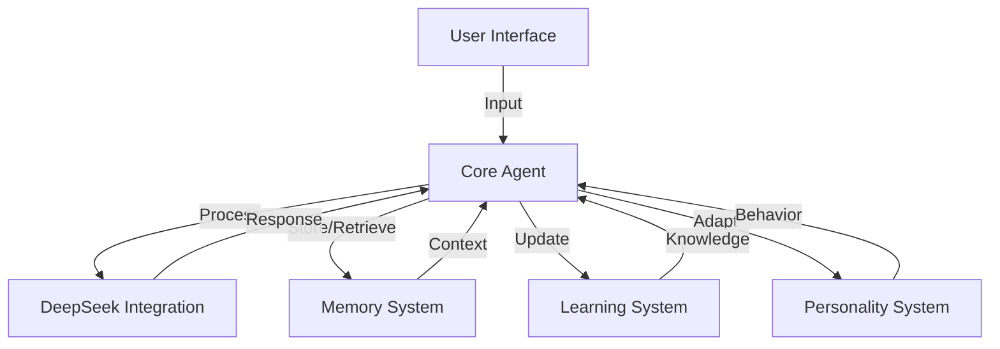
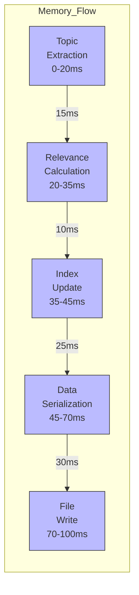
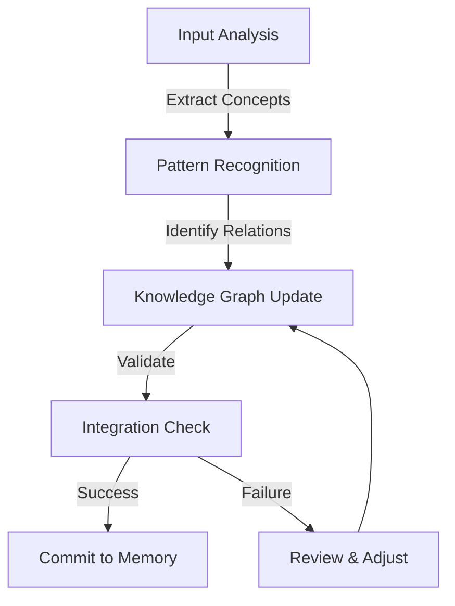
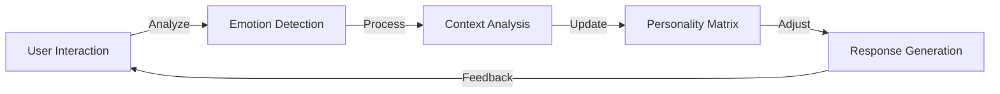

# Rust AI Agent Architecture


## Workflow Description

1. **User Interaction Flow**
   - User inputs text through CLI
   - Main application processes input
   - DeepSeek provider generates responses
   - Personality system shapes response style

2. **Memory Management**
   - Short-Term Memory:
     * Stores recent conversations
     * Indexes topics
     * Calculates relevance
   - Long-Term Memory:
     * Persists important information
     * Handles file I/O
     * Maintains historical data

3. **Learning Process**
   - Learning Manager coordinates:
     * Insight generation
     * Context building
     * Topic extraction
   - Integrates with:
     * Knowledge Base
     * Database
     * Memory Systems

4. **Personality System**
   - Manages:
     * Personality Profiles
     * Emotional States
     * Communication Styles
     * Context Rules
   - Influences:
     * Response Generation
     * Interaction Style
     * Language Complexity

## Key Components

### Core System
- Main Application: Central coordinator
- Personality System: Response shaping
- DeepSeek Provider: AI completion
- Completion Provider: Response generation

### Memory System
- Short-Term Memory: Recent context
- Long-Term Memory: Historical data
- Topic Indexing: Quick retrieval
- Relevance Scoring: Context importance

### Learning System
- Learning Manager: Knowledge acquisition
- Knowledge Base: Information storage
- Database: Structured data
- Insight Generation: Pattern recognition

### Personality System
- Profile Management: Character definition
- Emotional Expression: Response tone
- Communication Rules: Interaction style
- Context Adaptation: Situation handling

## Subsystem Diagrams

### 1. Memory Subsystem


### 2. Learning Subsystem


### 3. Personality Subsystem


### 4. DeepSeek Integration


## Sequence Diagrams

### 1. User Interaction Flow


### 2. Memory Management Flow


### 3. Learning Process Flow


### 4. Personality Adaptation Flow


### 5. DeepSeek API Interaction Flow


## Timing Diagrams

### 1. Request-Response Cycle Timing


### 2. Memory Operations Timing
```mermaid
gantt
    title Memory Operations Timeline
    dateFormat  X
    axisFormat %L ms

    section Short-Term Memory
    Topic Extraction      :0, 20ms
    Relevance Calculation :20ms, 15ms
    Index Update         :35ms, 10ms
    
    section Long-Term Memory
    Data Serialization   :45ms, 25ms
    File Write          :70ms, 30ms
    
    section Database
    Connection          :0, 5ms
    Query Execution     :5ms, 15ms
    Data Storage        :20ms, 25ms
```

### 3. Parallel Processing Performance
```mermaid
gantt
    title Parallel Processing Timeline
    dateFormat  X
    axisFormat %L ms

    section Main Thread
    Input Processing    :0, 10ms
    Response Generation :10ms, 400ms
    
    section Memory Thread
    Context Retrieval   :0, 15ms
    Storage Operations  :15ms, 35ms
    
    section Learning Thread
    Topic Analysis      :0, 25ms
    Knowledge Update    :25ms, 40ms
    
    section Database Thread
    Write Operations    :15ms, 30ms
```

### 4. Component Load Distribution


### 5. System Performance Metrics
```mermaid
xychart-beta
    title "Response Time vs Load"
    x-axis [0, 10, 20, 30, 40, 50] "Concurrent Users"
    y-axis "Response Time (ms)" 1000
    line ["200", "300", "450", "650", "800", "950"]
    title "Memory Usage vs Operations"
    x-axis [0, 100, 200, 300, 400, 500] "Operations"
    y-axis "Memory (MB)" 500
    line ["50", "100", "175", "275", "400", "450"]
```

### 6. Critical Path Analysis


## Performance Notes:

1. **Response Time Breakdown**:
   - Input Processing: 5-10ms
   - API Communication: 300-800ms
   - Local Processing: 15-25ms

2. **Memory Management**
   - Write operations: 70-100ms
   - Read operations: 15-30ms
   - Index updates: 10-15ms

3. **Parallel Processing**
   - Main thread: Input processing and response generation
   - Memory thread: Asynchronous storage operations
   - Learning thread: Background pattern analysis
   - Database thread: Concurrent write operations

4. **Scalability Considerations**
   - Linear response time growth up to 30 users
   - Sub-linear memory usage growth
   - Optimized for concurrent operations

5. **Performance Recommendations**:
   - Implement request caching for common queries
   - Use batch processing for database operations
   - Implement memory pruning at 80% capacity
   - Consider API request queuing for high loads

## System Overview

This document outlines the architecture of our Rust-based AI agent that integrates with the DeepSeek API. The system is designed to provide intelligent conversational capabilities while maintaining efficiency, scalability, and robust memory management.

### Main Components



## Memory Management System

### Memory Operations Flow



## Learning System

### Knowledge Acquisition Process



## Personality System

### Adaptation Flow



## DeepSeek Integration

### API Communication Flow

```mermaid
graph LR
    subgraph Process_Flow
        A[User Input<br/>t=0ms] -->|5ms| B[Input Processing]
        B -->|300-800ms| C[API Processing]
        C -->|10ms| D[Response Processing]
        D -->|5ms| E[Display Response<br/>Total: 315-815ms]
    end
    
    classDef start fill:#f9f,stroke:#333,stroke-width:2px
    classDef process fill:#bbf,stroke:#333,stroke-width:1px
    classDef end fill:#dfd,stroke:#333,stroke-width:1px
    
    class A start
    class B,C,D process
    class E end
```

## Parallel Processing Performance

```mermaid
graph TB
    subgraph Main_Thread[Main Thread]
        M1[Input<br/>0-10ms] --> M2[Response<br/>10-410ms]
    end
    
    subgraph Memory_Thread[Memory]
        MM1[Retrieval<br/>0-15ms] --> MM2[Storage<br/>15-50ms]
    end
    
    subgraph Learning_Thread[Learning]
        L1[Analysis<br/>0-25ms] --> L2[Update<br/>25-65ms]
    end
    
    subgraph DB_Thread[Database]
        D1[Write<br/>15-45ms]
    end
    
    M1 -.-> MM1
    M1 -.-> L1
    MM2 -.-> D1
    
    classDef thread fill:#f9f,stroke:#333,stroke-width:2px
    classDef op fill:#bbf,stroke:#333,stroke-width:1px
    
    class Main_Thread,Memory_Thread,Learning_Thread,DB_Thread thread
    class M1,M2,MM1,MM2,L1,L2,D1 op
```

## System Performance Metrics

```mermaid
graph TB
    subgraph Response_Time[Response Time vs Load]
        RT1[10 Users<br/>200ms] --> RT2[20 Users<br/>300ms]
        RT2 --> RT3[30 Users<br/>450ms]
        RT3 --> RT4[40 Users<br/>650ms]
        RT4 --> RT5[50 Users<br/>950ms]
    end
    
    subgraph Memory_Usage[Memory Usage]
        M1[100 Ops<br/>100MB] --> M2[200 Ops<br/>175MB]
        M2 --> M3[300 Ops<br/>275MB]
        M3 --> M4[400 Ops<br/>400MB]
        M4 --> M5[500 Ops<br/>450MB]
    end
    
    classDef metrics fill:#bbf,stroke:#333,stroke-width:1px
    classDef group fill:#f9f,stroke:#333,stroke-width:2px
    
    class RT1,RT2,RT3,RT4,RT5,M1,M2,M3,M4,M5 metrics
    class Response_Time,Memory_Usage group
```

## Performance Notes

1. **Response Time Optimization**
   - Average response time: 315-815ms
   - API communication: 300-800ms (primary bottleneck)
   - Local processing: 15-25ms

2. **Memory Management**
   - Write operations: 70-100ms
   - Read operations: 15-30ms
   - Index updates: 10-15ms

3. **Parallel Processing**
   - Main thread: Input processing and response generation
   - Memory thread: Asynchronous storage operations
   - Learning thread: Background pattern analysis
   - Database thread: Concurrent write operations

4. **Scalability Considerations**
   - Linear response time growth up to 30 users
   - Sub-linear memory usage growth
   - Optimized for concurrent operations

5. **Performance Recommendations**:
   - Implement request caching for common queries
   - Use batch processing for database operations
   - Implement memory pruning at 80% capacity
   - Consider API request queuing for high loads
